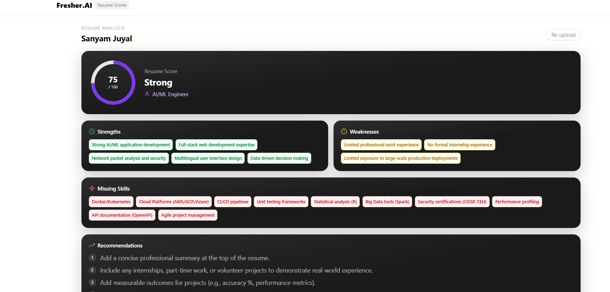
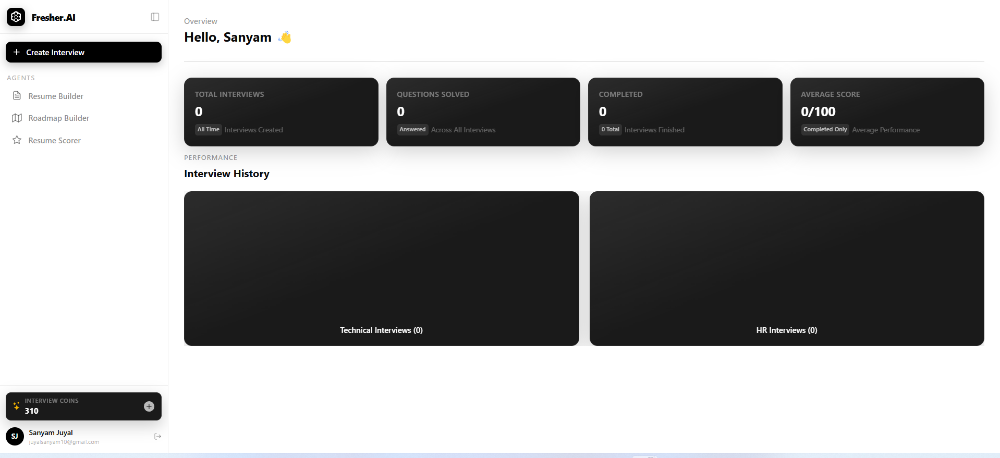

# Fresher.AI

> An AI-powered career workspace for sharper resumes, better interviews, and practical learning roadmaps.

<div align="center">
  <p>
    <strong>Resume scoring</strong>&nbsp;&nbsp;•&nbsp;&nbsp;
    <strong>AI interviews</strong>&nbsp;&nbsp;•&nbsp;&nbsp;
    <strong>Personalized roadmaps</strong>
  </p>
</div>

## Product Preview

<p align="center">
  
  
  
  
  
</p>

## What It Does

- **Resume Scorer** — extracts resume information, scores ATS readiness, and highlights strengths, weaknesses, missing skills, and recommendations.
- **Resume Builder** — create and preview a structured, ATS-friendly resume.
- **AI Interviews** — practice technical and HR interviews with adaptive questions, feedback, and reports.
- **Roadmap Generator** — turn a target role, salary goal, and resume into a focused learning path.
- **Progress Dashboard** — track interviews, scores, completed sessions, and interview credits.
- **Google Authentication** — secure sign-in through Firebase Authentication.

## Architecture

```text
React + Vite frontend
          │
          ▼
Express API gateway :8000
    ┌─────┼─────┬─────────┬─────────┐
    ▼     ▼     ▼         ▼         ▼
 Auth  Interview Resume  Roadmap  Billing
:8001   :8002   :8003    :8004     :8005
    └──────────────┬───────────────┘
                   ▼
          MongoDB Atlas + Redis
```

## Stack

| Layer | Technology |
| --- | --- |
| Frontend | React, Vite, Redux Toolkit, Tailwind CSS |
| Backend | Node.js, Express, Mongoose |
| AI | LangChain, Groq models, LangGraph |
| Authentication | Firebase Authentication and Firebase Admin |
| Data | MongoDB Atlas and Redis |
| Payments | Razorpay |

## Run Locally

### Prerequisites

- Node.js 20 or newer
- npm
- Docker Desktop
- A MongoDB Atlas cluster and database user
- Firebase project credentials
- Groq and Razorpay API credentials

### Project Structure

```text
fresher-ai/
├── frontend/                 # React + Vite application
├── backend/
│   ├── gateway/               # API gateway on :8000
│   ├── services/
│   │   ├── auth-service/      # Auth and sessions on :8001
│   │   ├── interview-service/ # Interviews on :8002
│   │   ├── resume-service/    # Resume analysis on :8003
│   │   ├── roadmap-service/   # Roadmaps on :8004
│   │   └── billing-service/   # Payments on :8005
│   └── shared/redis/          # Shared Redis client
└── README.md
```

### 1. Install dependencies

Install each package once from the repository root:

```powershell
cd C:\Users\<your-user>\Desktop\fresherAI

npm --prefix frontend install
npm --prefix backend\gateway install
npm --prefix backend\services\auth-service install
npm --prefix backend\services\billing-service install
npm --prefix backend\services\interview-service install
npm --prefix backend\services\resume-service install
npm --prefix backend\services\roadmap-service install
```

### 2. Start Redis

```powershell
cd backend
docker compose up -d redis
docker compose ps
```

Redis must be available at `localhost:6379`.

### 3. Configure environment files

Create these ignored files locally. Never commit API keys, database passwords, Firebase service accounts, or `.env` files.

Each backend service needs its own `.env` file:

```text
backend/services/auth-service/.env
backend/services/billing-service/.env
backend/services/interview-service/.env
backend/services/resume-service/.env
backend/services/roadmap-service/.env
backend/gateway/.env
frontend/.env
```

Required backend configuration includes:

```env
PORT=8001
MONGODB_URL=mongodb://...
REDIS_URL=redis://localhost:6379
GROQ_API_KEY=...
```

For interview, resume, and roadmap services, optionally set the Groq fallback order:

```env
GROQ_MODELS=llama-3.1-8b-instant,openai/gpt-oss-20b,qwen/qwen3-32b
```

The gateway `.env` must point to the local services:

```env
PORT=8000
AUTH_SERVICE_URL=http://localhost:8001
INTERVIEW_SERVICE_URL=http://localhost:8002
RESUME_SERVICE_URL=http://localhost:8003
ROADMAP_SERVICE_URL=http://localhost:8004
BILLING_SERVICE_URL=http://localhost:8005
```

The frontend requires:

```env
VITE_FIREBASE_APIKEY=...
VITE_RAZORPAY_KEY_ID=...
```

Add the machine's current public IP to the MongoDB Atlas Network Access list before starting the services.

### 4. Start the backend

Run each command in a separate terminal. Start Redis first, then the services, then the gateway.

```powershell
# Auth service
cd C:\Users\<your-user>\Desktop\fresherAI\backend\services\auth-service
npm run dev
```

```powershell
# Interview service
cd C:\Users\<your-user>\Desktop\fresherAI\backend\services\interview-service
npm run dev
```

```powershell
# Resume service
cd C:\Users\<your-user>\Desktop\fresherAI\backend\services\resume-service
npm run dev
```

```powershell
# Roadmap service
cd C:\Users\<your-user>\Desktop\fresherAI\backend\services\roadmap-service
npm run dev
```

```powershell
# Billing service
cd C:\Users\<your-user>\Desktop\fresherAI\backend\services\billing-service
npm run dev
```

```powershell
# Gateway
cd C:\Users\<your-user>\Desktop\fresherAI\backend\gateway
npm start
```

### 5. Start the frontend

```powershell
cd C:\Users\<your-user>\Desktop\fresherAI\frontend
npm run dev
```

Open [http://localhost:5173](http://localhost:5173).

### 6. Verify the process

Check the gateway:

```powershell
Invoke-WebRequest http://localhost:8000 -UseBasicParsing
```

Expected startup messages include:

```text
Connected to MongoDB
Auth Service Running
Gateway Started on 8000
Roadmap Service Started on 8004
```

If a service exits with a MongoDB selection error, add the current public IP to Atlas and wait until the access-list entry is **Active**. If a service exits with `ENOSPC`, clear disk space and the npm cache before reinstalling dependencies.

## Service Map

| Service | Port | Responsibility |
| --- | ---: | --- |
| Gateway | 8000 | CORS, cookies, authentication middleware, proxying |
| Auth | 8001 | Firebase token verification, users, sessions, credits |
| Interview | 8002 | Interview graph, questions, feedback, reports |
| Resume | 8003 | PDF extraction, AI analysis, ATS scoring |
| Roadmap | 8004 | AI roadmap generation and learning resources |
| Billing | 8005 | Razorpay orders and payment verification |

## Security Notes

- Rotate any API keys or database credentials that have been exposed during development.
- Keep `.env` files and `serviceAccountKey.json` outside Git.
- Use a specific `/32` IP in Atlas for local development instead of `0.0.0.0/0`.
- Do not use production credentials in local development.

## License

This project is currently provided for personal and educational use.
